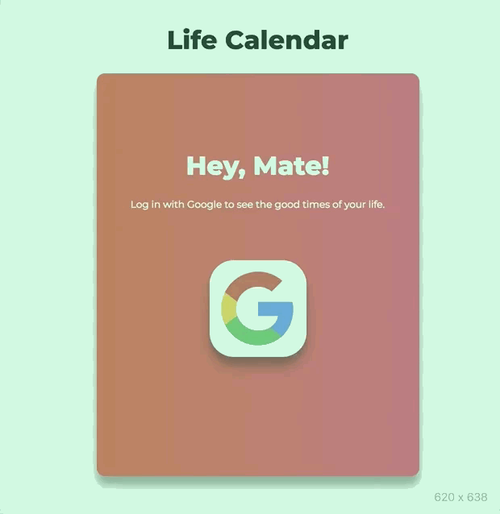

# Life Calendar
###### OAuth 2.0 authentication and Google Calendar's API - displaying good times of your life!

## Demo

## Local set up
###### Set up process assumes that all of the above technologies are available on your local machine
1. Run `git clone https://github.com/terrancexin/life_calendar && cd life_calendar && npm i`
2. Obtain OAuth 2.0 credentials from the Google API Console. `client_id` and `client_secret` add into `oauth2.keys.json` file
5. `cd client && npm i`
4. Make sure `redis-server` is running locally
3. Start the app by `npm run dev` at the root directory
###### Ready! Go to: [http://localhost:3000](http://localhost:3000)

## Tech Stack
- [React Hooks](https://reactjs.org/docs/hooks-overview.html)
- [Node.js](https://nodejs.org/en/)
- [Express](http://expressjs.com/)
- [Redis](https://redis.io/)
- [OAuth 2.0](https://www.npmjs.com/package/google-auth-library)
- [Google APIs](https://www.npmjs.com/package/googleapis)

## High Level Overview
Google Calendar authorization with OAuth 2.0
- Log in with Google account
- View events from Calendar

## Google Authorization Server
- Before application can access private data using a Google API, it must obtain an access token that grants access to that API
- A single access token can grant varying degrees of access to multiple APIs
- Send the access token to an API
- Refresh the access token, if necessary

## User Stories
- As a user, I want to authenticate with my Google account.
- As a user, I want to display my events from Google calendar.
- As a user, I want to be able to logout.

## Future Implementations
- [x] Backend refactoring and clean up
- [x] Deploy on Heroku
- Implement redis to make subsequent calls from cache
- Edge cases
  - Display date once for all events on the same day
  - Add indicator to show past events
- Unit tests
- Add more responsiveness on the UI